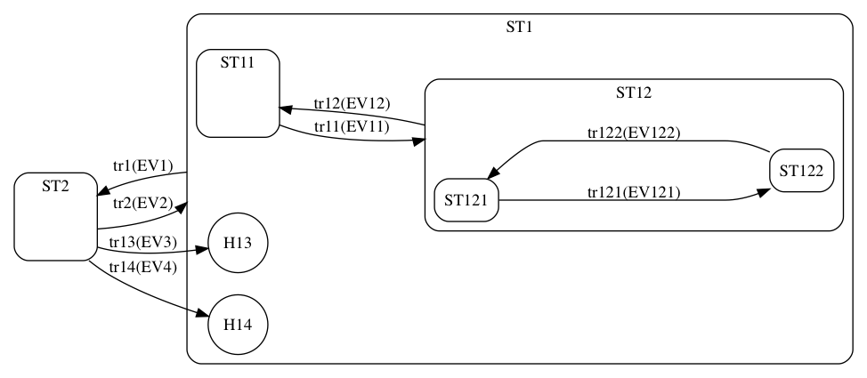

# Example State Machine

* H13 is a history state. When a transition occurred and come to this type of state the state machine returns
to last state on that level and reinit lower states. 

* H14 is a deep history state. When a transition occurred and come to this type of state the state machine returns
to last state on deepest level. 